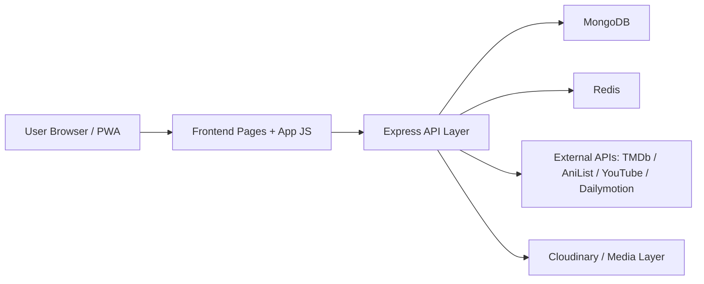

# CINESTREAM V3: THE ROYAL UPDATE

## Comprehensive Technical Manifesto

## Executive Summary

| Module | Technical Innovation | Real-World Benefit |
|---|---|---|
| Ingest Engine | Automated metadata hydration via oEmbed, TMDb, AniList, and Dailymotion APIs | Add and normalize large content batches dramatically faster with less manual admin work |
| Phantom Player | Sandboxed iframe architecture, source normalization, branded masking layer | Use external delivery sources while preserving CineStream’s premium brand surface |
| Subtitle Proxy | Node.js middleware plus Redis-backed subtitle caching and WebVTT transformation | Multi-language reach without manual subtitle management or client-side CORS failures |
| Royal UI | State-aware filtering, glassmorphism, hero blending, curated rails, dynamic profile stats | A premium app-like experience that feels fast, cinematic, and intentional |
| PWA v3 | Service Worker navigation caching, static asset preloading, offline-first fallbacks | Reduced flicker, repeat-visit speed, and installable app behavior |
| Admin Control Plane | Smart ingest, source typing, source quality checks, analytics wiring | More reliable content operations and fewer broken playback experiences |
| Data Layer | MongoDB content schemas plus Redis cache augmentation | Durable catalog storage with strategic high-speed caching where it matters |
| DevOps Runtime | Docker Compose with isolated backend, MongoDB, and Redis services | Faster onboarding, reproducible environments, and cleaner deployment discipline |

---

## 1. The Vision & Core Value Proposition

### 1.1 The Market Problem

The internet is full of amateur streaming clones. Most of them fail in the same predictable ways:

- They look generic.
- They depend on brittle video links.
- They require too much manual admin work.
- They treat metadata as an afterthought.
- They break when external providers change formats.
- They have poor mobile behavior.
- They have weak branding and no emotional design identity.
- They cannot scale content operations without chaos.

In practical terms, these systems are not platforms. They are fragile pages with a few players and a database.

Their core weaknesses are architectural:

| Failure Pattern | Typical Clone Behavior | Business Impact |
|---|---|---|
| Manual ingest | Admins paste titles, images, and links by hand | Slow growth, high error rate |
| Weak player architecture | Raw embeds, provider redirects, branding leakage | Trust loss, poor retention |
| No source governance | Broken links remain live | Playback failure, support burden |
| Flat UI | No cinematic hierarchy, no curation logic | Low engagement |
| Thin profile layer | User stats and watch state feel fake | No habit formation |
| No cache strategy | Repeated cold API calls | Slow page load, API exhaustion |
| No environment discipline | “Works on my machine” deployment | Release instability |

### 1.2 The CineStream Solution

CineStream V3 is designed as a high-performance, brand-controlled streaming CMS, not a template site.

Its value proposition is simple:

- Automate the boring work
- Control the presentation layer
- Normalize external chaos into an internal standard
- Make the experience feel premium even when source infrastructure is hybrid

CineStream does not try to win by being only a player. It wins by becoming a content operating system.

### 1.3 Core Product Thesis

CineStream V3 is built on four strategic beliefs:

| Product Thesis | Meaning |
|---|---|
| Streaming UX is trust UX | If playback, visuals, and navigation feel premium, users assume the platform is credible |
| Admin speed is content scale | The faster metadata, sources, and subtitles can be onboarded, the faster the library grows |
| External sources need internal control | Third-party video can be used, but branding, switching, masking, and validation must remain in CineStream |
| Data must serve both product and operations | Catalog data is not just for rendering cards. It powers recommendations, analytics, watch progress, and automation |

### 1.4 The Royal Update

The Royal Update is not a cosmetic pass. It is a systems-level alignment across:

- backend contracts
- player abstraction
- subtitle delivery
- admin ingest automation
- state-aware homepage logic
- premium visual hierarchy
- profile credibility
- PWA reliability

This turns CineStream from a functional project into a positionable digital product.

---

## 2. System Architecture: The Engine

### 2.1 High-Level Architecture

### 2.1.1 Architectural Style

CineStream uses a modular monolith strategy:

- one backend runtime
- route-based domain separation
- middleware-driven cross-cutting concerns
- persistent data in MongoDB
- opportunistic caching in Redis
- asset delivery via local/external media plus CDN-backed services

This is the right architecture for the current phase because it balances:

- development speed
- operational simplicity
- low cognitive overhead
- future refactorability

### 2.2 Backend Architecture

#### 2.2.1 Node.js + Express Foundation

The backend is structured around Express as an API orchestration layer. This works well because CineStream requires:

- fast iteration
- flexible middleware chains
- mixed sync/async route logic
- compatibility with file upload flows
- direct API proxying and transformation

#### 2.2.2 Modular Routing

The backend is separated into domain-focused route modules such as:

| Route Domain | Purpose |
|---|---|
| Auth | Registration, login, profile, watchlist, account stats |
| Users | Unified user profile payload including live counts and collections |
| Movies | Catalog listing, search, trending, CRUD, ratings, sources |
| Episodes | Episode-specific playback and source management |
| Watch | Watch history, progress persistence, continue watching |
| Comments | Reviews, engagement, social layer |
| Analytics | Admin dashboard metrics and content distribution |
| TMDb | Import and enrichment from The Movie Database |
| AniList | Anime-first ingestion and catalog seeding |
| Subtitles | Subtitle proxying and caching |
| Notifications | User engagement hooks |

This route modularity creates three benefits:

- cleaner responsibility boundaries
- easier defect isolation
- simpler onboarding for future contributors

#### 2.2.3 Middleware Strategy

CineStream’s middleware layer is one of its strongest architectural decisions.

Key middleware patterns include:

| Middleware Role | Function |
|---|---|
| Auth protection | Guards privileged actions and user-only routes |
| Admin gating | Restricts ingestion and platform control actions |
| Response formatting | Enforces API contract consistency |
| Source quality checking | Validates and classifies playback sources |
| Error normalization | Keeps failures predictable and debuggable |
| CSP / Helmet security | Protects the frontend surface while supporting embeds |

#### 2.2.4 Source Quality Checks

The source-quality layer is critical because CineStream supports multiple video origin types:

- local
- YouTube
- Dailymotion

Instead of trusting arbitrary links, the backend and shared helper logic determine:

- source type
- canonical embed URL
- malformed state
- offline fallback state

That prevents the platform from exposing raw provider chaos directly to the user.

### 2.3 Database Architecture

#### 2.3.1 MongoDB as the Primary Content Store

MongoDB is a strong fit for CineStream because the platform manages mixed-shape content objects:

- movies
- anime
- series
- episodes
- subtitles
- source arrays
- ratings
- provider metadata
- watch history references

#### 2.3.2 Core Schema Design

| Entity | Role |
|---|---|
| User | identity, role, avatar, watchlist, verification state |
| Movie | title, metadata, media fields, source type, quality variants, provider IDs |
| Episode | episodic playback unit with independent source handling |
| WatchHistory | normalized ref-based watch tracking per user and content |
| Comment | review/engagement layer |
| Notification | user-facing system communication |

#### 2.3.3 Why Ref-Based Watch History Matters

Watch history is not embedded inside the user document. That is the correct design.

Benefits:

- avoids unbounded user document growth
- enables sorting and aggregation independently
- supports progress-based queries
- powers continue watching efficiently
- supports multi-device consistency

#### 2.3.4 Indexing Philosophy

| Index Area | Purpose |
|---|---|
| `title` | faster discovery and title lookups |
| `category` | stronger curation rails and filtering |
| `createdAt` | freshness-based rails and ranking |
| `tmdbId` / `anilistId` | duplicate prevention and import alignment |
| sparse provider indexes | avoids invalid uniqueness collisions on partial data |

### 2.4 Redis Caching Layer

Redis is used where it creates the most value.

#### 2.4.1 Strategic Redis Use

| Use Case | Why Redis Is Appropriate |
|---|---|
| Subtitle proxy caching | External subtitle APIs are slow and rate-limited |
| API response buffering | Repeat reads should be cheap |
| Future session/rate-limiting expansion | High-speed ephemeral state fits Redis naturally |

#### 2.4.2 Subtitle Cache TTL

Subtitle responses are cached for 24 hours, which is smart because:

- subtitles change infrequently
- external provider calls should be minimized
- repeated playback sessions should not hammer external APIs

### 2.5 DevOps and Runtime Orchestration

#### 2.5.1 Docker Compose Topology

CineStream runs as a three-service local stack:

| Service | Responsibility |
|---|---|
| Backend | API server, routing, ingest, proxy logic |
| MongoDB | persistent catalog and user state |
| Redis | cache and ephemeral acceleration layer |

#### 2.5.2 Why Compose Is the Right Tool Here

Docker Compose gives CineStream:

- consistent local environments
- isolated dependencies
- simpler rebuild cycles
- easier debugging of backend/database/cache relationships

#### 2.5.3 Operational Discipline

One of the key lessons in V3 is that schema changes are not real until the container is rebuilt.

That is why the clean-sync workflow matters:

1. stop services
2. clear dependent runtime state where required
3. rebuild backend image
4. restart full stack
5. verify container status

---

## 3. Feature Deep Dive: The Innovations

### 3.1 Smart Ingest Engine

The Smart Ingest Engine is one of CineStream’s biggest competitive advantages.

#### 3.1.1 Problem It Solves

Manual content entry is operationally expensive.

Without automation, admins must hand-enter:

- title
- artwork
- duration
- source type
- thumbnail
- category

#### 3.1.2 How the Ingest Engine Works

When an admin pastes a URL into the ingest form, the system:

1. detects the provider via regex
2. extracts the provider-specific video ID
3. calls the matching provider metadata service
4. auto-fills title, duration, thumbnail, and source type
5. infers content category based on naming patterns

#### 3.1.3 Provider Strategies

| Provider | Method |
|---|---|
| YouTube | oEmbed for title plus deterministic thumbnail URL construction |
| Dailymotion | Data API request for title, duration, and high-quality thumbnail |
| TMDb | list/detail APIs for movies and TV metadata |
| AniList | anime-native GraphQL metadata import |

#### 3.1.4 Real Product Impact

This means the admin experience becomes:

- faster
- cleaner
- less error-prone
- more consistent across the library

### 3.2 The Phantom Player

The Phantom Player is a brand-preserving playback abstraction layer.

#### 3.2.1 Core Challenge

If CineStream uses YouTube or Dailymotion directly, the platform risks:

- third-party branding leakage
- title redirect clicks
- inconsistent control surfaces
- non-premium presentation

#### 3.2.2 CineStream Solution

The Phantom Player wraps provider embeds inside a controlled shell.

| Component | Purpose |
|---|---|
| Source detector | Determines if source is local, YouTube, or Dailymotion |
| Universal cleaner | Transforms arbitrary provider links into canonical embed URLs |
| Sandboxed iframe | Restricts capabilities and reduces unsafe surface area |
| Title mask | Prevents provider title click-out behavior |
| Offline UI fallback | Replaces raw provider failure with branded state |
| Source switching logic | Routes to the correct playback surface |

#### 3.2.3 Sandboxing Strategy

The iframe is constrained with permissions such as:

- `allow-scripts`
- `allow-same-origin`
- `allow-presentation`

#### 3.2.4 Brand Preservation Layer

The title mask prevents a common embed failure mode:

- user clicks provider title
- user exits CineStream
- brand ownership is lost

### 3.3 Subtitle Proxy

The subtitle system is one of the most technically strategic features in V3.

#### 3.3.1 Why a Subtitle Proxy Exists

If the browser calls subtitle providers directly, it runs into:

- CORS restrictions
- inconsistent provider formats
- repeat API exhaustion
- no central caching layer

#### 3.3.2 CineStream Strategy

The backend becomes a middleman.

Flow:

1. frontend requests subtitles from CineStream
2. backend detects provider type
3. backend fetches subtitle data from provider
4. backend normalizes output into WebVTT
5. backend caches the result in Redis
6. frontend receives a clean subtitle payload

#### 3.3.3 Provider Handling

| Provider | Subtitle Strategy |
|---|---|
| YouTube | fetch caption data and transform to valid WebVTT |
| Dailymotion | fetch subtitle track URLs and return cached VTT content |

#### 3.3.4 Why WebVTT Matters

By standardizing on VTT:

- the frontend becomes simpler
- tracks can be injected consistently
- provider differences disappear from the UI layer

### 3.4 Service Worker v3

The PWA layer is a major contributor to perceived quality.

#### 3.4.1 Why It Matters

Fast-feeling products win. Service Worker v3 helps CineStream feel closer to a native app by:

- caching static assets
- caching known page shells
- handling offline fallback
- preserving repeat navigation speed

#### 3.4.2 Architectural Behavior

| Layer | Strategy |
|---|---|
| Static assets | cache-first |
| API calls | network-first with fallback |
| HTML pages | network-first with cached fallback |
| External embeds/streams | deliberately excluded from cache |

#### 3.4.3 Why External Streams Are Excluded

Caching external media streams:

- wastes storage
- increases memory pressure
- complicates invalidation
- adds little value

### 3.5 Delivered Innovations in the Royal Update

| Delivered Feature | Status | Product Effect |
|---|---|---|
| Wrapper-aware API parsing | Delivered | Frontend and backend contract aligned |
| Smart media metadata ingest | Delivered | Faster admin workflows |
| Multi-source universal player | Delivered | Cleaner playback abstraction |
| Subtitle proxy with Redis cache | Delivered | Global subtitle delivery |
| Trending rails and category state | Delivered | Stronger homepage merchandising |
| Dynamic profile stats | Delivered | Trustworthy account surface |
| Premium home visual system | Delivered | Higher perceived product value |
| Source quality validation | Delivered | Better playback reliability |
| Logo-ready TMDb content shape | Delivered | Premium title branding support |

### 3.6 High-Value Features Still Available to Add

| Opportunity | Why It Matters |
|---|---|
| Avatar asset pack integration | Convert the elite avatar concept into a branded selectable library |
| Provider logo backfill job | Populate `logoUrl` for previously imported TMDb titles |
| Personalized home rails | Build rails from watch history, genres, and recency |
| Admin source health dashboard | Show broken, stale, or high-risk sources in one place |
| Background metadata jobs | Move large ingest work into queue-based async processing |
| Multi-profile households | Support shared device use-cases like commercial platforms |
| Search ranking engine | Blend text match, rating, views, and freshness |
| Recommendation scoring layer | Go beyond basic rails into taste modeling |
| Push-driven release notifications | Re-engage users with personalized content drops |
| Analytics export suite | Investor/admin reporting from a clean BI surface |

---

## 4. The Royal UI/UX Design System

### 4.1 Design Philosophy

The Royal design system is about authority, curation, and cinematic trust.

Its goals:

- reduce template feel
- increase premium perception
- create visual hierarchy
- preserve legibility over media-heavy backgrounds
- make every state feel deliberate

### 4.2 Glassmorphism

Glassmorphism is used selectively, not excessively.

Where it appears:

- hero badges
- spotlight controls
- action buttons
- selected premium surfaces

Why it works:

- it creates depth
- it separates interaction layers from artwork
- it feels contemporary without losing seriousness

### 4.3 Cinematic Blending

The hero system uses blending and masking to avoid the poster pasted on a black box problem.

| Technique | Purpose |
|---|---|
| right-edge mask image | fades subject art into background |
| bottom gradient | anchors the hero into the page shell |
| radial highlight layers | creates premium atmosphere |
| text shadow depth | preserves readability over image noise |

### 4.4 State-Aware Filtering

The homepage filtering model creates a modern browsing experience.

Behavior:

- click Movies, Anime, or Series
- update URL query params without reload
- re-fetch data
- update active visual state
- change copy and content emphasis

### 4.5 The Profile Redesign

The profile page is now a trust surface.

| Element | Upgrade |
|---|---|
| Avatar | larger 150px treatment with premium framing |
| Header | transformed into a hero-card style surface |
| Verified badge | animated subtle emphasis |
| Stats | live values from backend data |
| Background | dynamic backdrop from recent watch behavior |

### 4.6 Royal Visual Tokens

| Token Family | Direction |
|---|---|
| Primary accent | red for authority and action |
| Rose gold ratings | warmer premium signal than flat yellow |
| Backgrounds | layered blacks and deep charcoal |
| Borders | subtle translucent whites and accented reds |
| Typography | bold display hierarchy with strong shadows |
| Rail treatment | clean scroll behavior, rank emphasis, high-contrast logos |

---

## 5. The Teacher’s Guide: How It Works

### 5.1 How a URL Becomes a Movie Card in 3 Steps

#### Step 1: Normalize the Source

An admin pastes a media URL.

The system:

- detects provider
- extracts canonical ID
- fetches metadata
- assigns source type
- previews thumbnail and title

#### Step 2: Persist as Structured Content

The backend stores the result as a movie document with:

- title
- category
- thumbnail/banner/logo
- source type
- provider identifiers
- duration
- ratings and metadata

This means the URL is no longer just a link. It is now catalog data.

#### Step 3: Render Through CineStream’s UI Layer

The homepage, search page, profile watchlist, and player all consume the structured movie object.

That object becomes:

- a hero spotlight
- a trending rail card
- a search result
- a watchlist item
- a playback source

### 5.2 Simplified Flow Table

| Stage | What Happens | Why It Matters |
|---|---|---|
| Input | Admin pastes URL or imports provider content | Fast onboarding |
| Detection | Source/provider type is identified | Correct logic path |
| Enrichment | Metadata APIs return title, art, duration | Better content quality |
| Storage | MongoDB stores normalized document | Reusable across product surfaces |
| Validation | Source quality checks prevent broken playback states | Reliability |
| Delivery | Frontend renders cards, rails, spotlight, and player | Product consistency |
| Retention | Watch history and watchlist feed profile and navigation | Habit loop |

---

## 6. Product Positioning for Stakeholders

### 6.1 For Investors

CineStream V3 should be positioned as:

- a branded streaming CMS
- an automation-first media operations platform
- a premium UI layer over hybrid content infrastructure
- a scalable foundation for curated streaming experiences

### 6.2 For Operators

CineStream V3 reduces operational drag through:

- metadata automation
- provider normalization
- subtitle centralization
- stable admin workflows
- reproducible Docker environments

### 6.3 For End Users

CineStream V3 delivers:

- faster browsing
- cleaner playback
- more premium aesthetics
- believable profile/account state
- stronger mobile and repeat-visit experience

---

## 7. Strategic Conclusion

CineStream V3: The Royal Update is not simply a redesign.

It is the convergence of:

- automation
- branded playback control
- structured content operations
- platform-grade caching
- premium visual identity
- user-state credibility

That combination is what separates a streaming clone from a real product.

The platform now has a compelling core thesis:

> CineStream is a high-performance, automation-driven streaming CMS with a premium consumer surface and a scalable operator workflow.

---

## 8. Final Executive Takeaway

If CineStream V2 was a working platform, V3 is the first version that behaves like a category contender.

Its strengths are now clear:

- operational speed
- playback abstraction
- subtitle intelligence
- reliable state sync
- premium curation UI
- reproducible architecture

Its next growth path is equally clear:

- richer personalization
- logo backfill automation
- premium avatar asset packs
- advanced recommendation scoring
- deeper admin intelligence

That is the shape of a platform with real product gravity.
